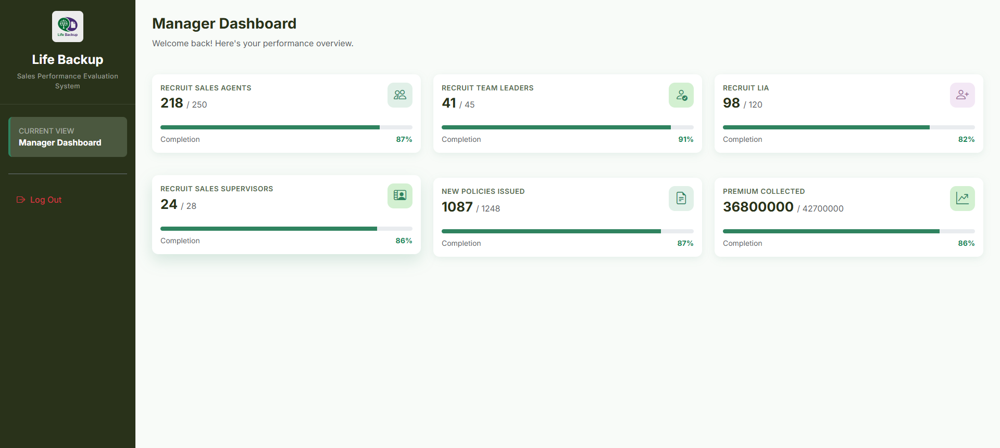
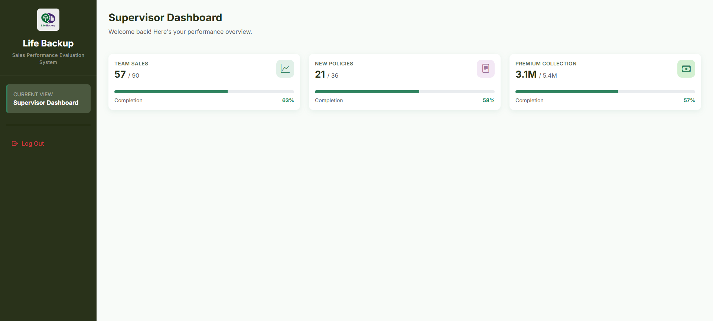
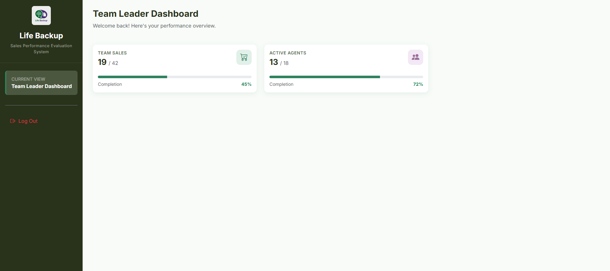
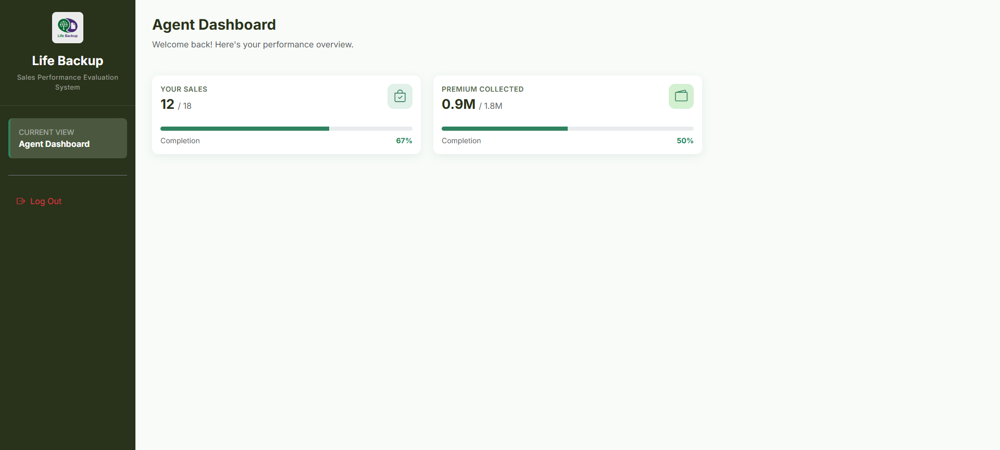
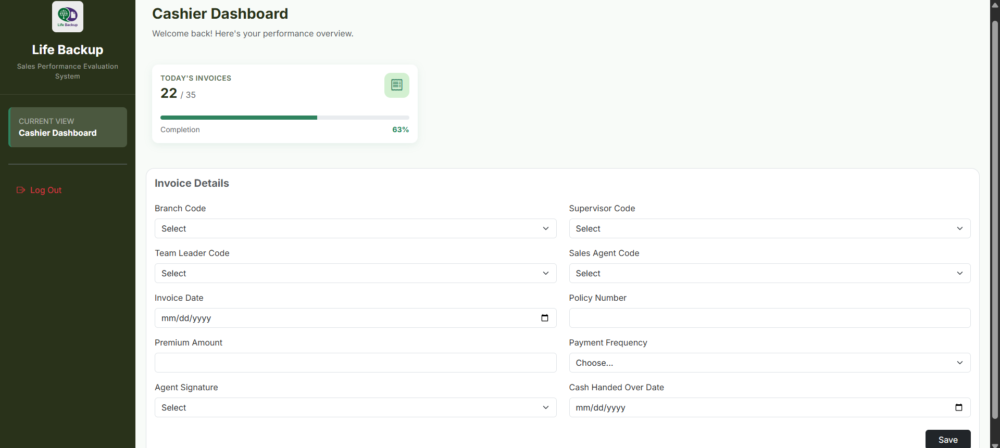

# Life Backup - Sales Performance Evaluation System (SPES)

A centralized, web-based database application developed for "Life Backup" insurance company to monitor and evaluate sales force performance in real-time. This system utilizes **PHP**, **AJAX**, and **MySQL** to provide a seamless, non-refreshing user experience across multiple administrative roles.

## Key Features
* **Role-Based Access Control (RBAC):** Specialized login portals for Branch Managers, Supervisors, Team Leaders, Sales Agents, and Cashiers, each with unique access permissions.
* **AJAX-Powered Authentication:** A secure login system that authenticates and redirects users to their specific dashboards without full page reloads.
* **Access Security:** User credentials are protected using MD5 hashing within the centralized database.
* **Dynamic Performance Tracking:** Real-time dashboards featuring progress bars to track recruitment targets, new policy issuances, and premium collection metrics.
* **Automated Data Entry Point:** A dedicated interface for Cashiers to input sales invoices and premium collections directly into the centralized database.
* **Advanced Target Logic:** Metrics are automatically calculated as a percentage of monthly targets completed, providing instant performance feedback.

## Tech Stack
* **Backend:** PHP (Core logic and session management).
* **Asynchronous Logic:** AJAX (for data fetching and non-refreshing UI updates).
* **Database:** MySQL (Relational schema involving agents, supervisors, and invoices).
* **Frontend:** HTML5, CSS3, and JavaScript.

## Interface Preview & Role-Based Dashboards
The system dynamically serves unique dashboards based on the logged-in user's organizational role.

### 1. Secure Login Portal
Unified login entry for all sales force members utilizing AJAX verification.

### 2. Branch Manager Dashboard
Tracks branch-wide recruitment of Supervisors/Advisors and cumulative sales targets.

### 3. Sales Supervisor Dashboard
Monitors recruitment and combined targets for Team Leaders and Agents under their purview.

### 4. Team Leader Dashboard
Focuses on personal recruitment of Agents and tracking individual policy issuance goals.

### 5. Sales Agent Dashboard
Target tracking for individual policy introductions and LKR 300,000 monthly premium collection.

### 6. Advisor Dashboard
Dedicated tracker for Life Insurance Advisors to monitor their specific LKR 750,000 premium targets.

### 7. Branch Cashier (Data Entry)
The exclusive interface for manual entry of premium collection sales invoices and tracking daily quotas.

## Setup & Installation
1. **Initialize Database:** Import the `create logins.sql` script into your MySQL environment to set up role-based accounts and tables.
2. **Server Deployment:** Deploy the project folder to your local server (WAMP/XAMPP).
3. **Configuration:** Ensure your database credentials match in the connection logic.
4. **Access Portal:** Navigate to `localhost/spesv3/page.php` in your browser.

### Access Credentials
Use the following pre-configured accounts to explore different dashboard roles:

| Role | Agent Code | Password |
| :--- | :--- | :--- |
| Manager | 10001 | pass123 |
| Supervisor | 20001 | pass123 |
| Team Leader | 30001 | pass123 |
| Sales Agent | 40001 | pass123 |
| Advisor | 50001 | pass123 |
| Cashier | 60001 | pass123 |

---
*Developed by Thilina Sandakelum Wijesinghe for the Web Technology and Applications module | Department of Software Technology at University of Vocational Technology (UoVT).*
